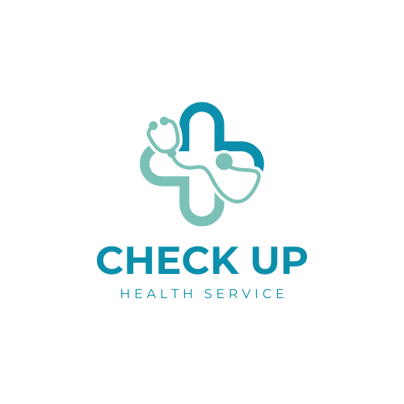

# CheckUp

This is a project based on the results and progress of medical report . 

- Techinal Complexity : It requires huge database and a lot of backend code.

- UI: This is the rather eye catching design which on fruitful growth will act as trade mark

- Business Model: Besides download from playstore or app store, we can charge a premium for complex tests.

- Public implementation: Target customer(the medical report reciever) will not have to wait for the report analysis. Their impatience will be our income.

# How to use this app

- download this repository to local machine and then open terminal

- use "npm start" ....

- open browser and search "localhost:8000"

- app will get displayed 

# Facing ISSUE??

- you may not have install node in your local machine. So install nodejs from -- https://nodejs.org/en/

- you may not open the terminal in the correct directory. you have to be in the folder name "TODOLIST_DB".
